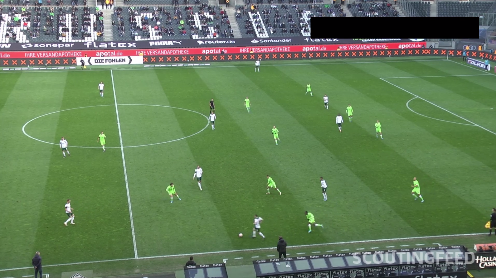
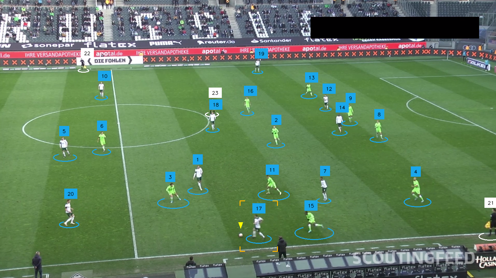

# Football Shootout Analysis

This repository provides tools and methods for analyzing football shootouts. The project focuses on various tasks, including tracking players and the ball, identifying the player with the ball, and dividing teams based on their jerseys using advanced techniques such as SigLip, UMAP, and KMeans clustering.


## Installation

To get started, clone the repository and install the required dependencies:

```bash
git clone https://github.com/xAn-x/Football-Shootout-Analysis.git
cd Football-Shootout-Analysis
pip install -r requirements.txt
```
--- 

## Original Images vs. Model Results

This section displays the original images alongside the results produced by the model. The comparison highlights the effectiveness of the analysis in detecting and tracking players and the ball.

| Original  | Model Result |
|----------------|--------------|
|  |  |
|  | |

---

Feel free to add more rows for additional images or adjust the text as needed! Let me know if you need anything else.

## Key Features

- **Player and Ball Tracking**: Implement tracking algorithms to follow players and the ball throughout the shootout.
- **Finding Player with the Ball**: Automatically identify which player has the ball at any given moment.
- **Team Division by Jersey Color**: Utilize SigLip, UMAP, and KMeans to cluster players based on their jersey colors, effectively dividing teams for analysis.


## Contributing

Contributions are welcome! Feel free to submit a pull request or open an issue if you have suggestions or improvements.
